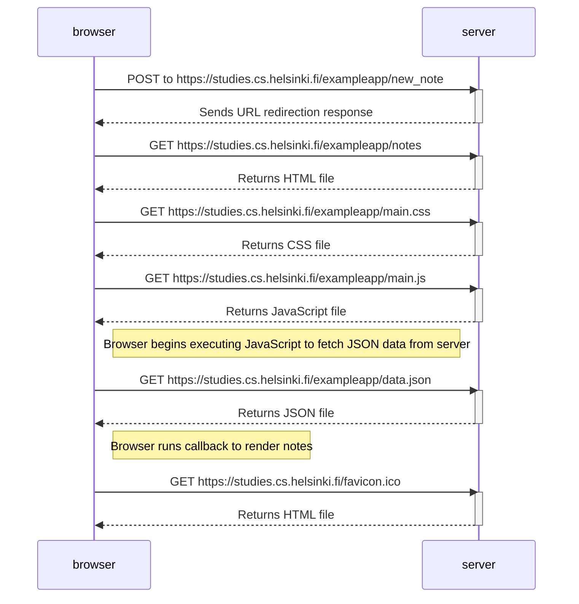

```mermaid
sequenceDiagram
participant browser
participant server

    browser->>server: POST to https://studies.cs.helsinki.fi/exampleapp/new_note
    activate server
    server-->>browser: Sends URL redirection response
    deactivate server

    browser->>server: GET https://studies.cs.helsinki.fi/exampleapp/notes
    activate server
    server-->>browser: Returns HTML file
    deactivate server

    browser->>server: GET https://studies.cs.helsinki.fi/exampleapp/main.css
    activate server
    server-->>browser: Returns CSS file
    deactivate server

    browser->>server: GET https://studies.cs.helsinki.fi/exampleapp/main.js
    activate server
    server-->>browser: Returns JavaScript file
    deactivate server

    Note right of browser: Browser begins executing JavaScript to fetch JSON data from server

    browser->>server: GET https://studies.cs.helsinki.fi/exampleapp/data.json
    activate server
    server-->>browser: Returns JSON file
    deactivate server

    Note right of browser: Browser runs callback to render notes

    browser->>server: GET https://studies.cs.helsinki.fi/favicon.ico
    activate server
    server-->>browser: Returns HTML file
    deactivate server
```
